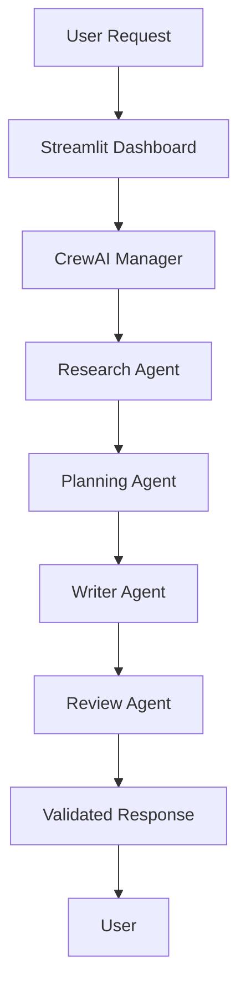

<p align="center">
  
</p>

<div align="center">


<br>


</div>

---

# Overview

AI CrewAI is an enterprise-grade **Multi-Agent AI Automation Platform** built using **CrewAI**, **LangChain**, and **Groq LLMs**. The platform coordinates multiple autonomous AI agents that collaborate on research, planning, content generation, validation, and final response generation through an intelligent workflow orchestration pipeline.

Its modular architecture allows specialized agents to execute independent tasks while maintaining a unified AI workflow for high-quality and scalable content generation.

---

## 🎥 Demo Preview


<a href="https://screenrec.com/share/NjbyQJ4cir" target="_blank">


</a>

👉 [Click here to watch full screen demo](https://screenrec.com/share/NjbyQJ4cir)


# Core Capabilities

| Capability | Description |
|------------|-------------|
| Multi-Agent Collaboration | Autonomous AI agents working together |
| Research Automation | AI-powered information gathering |
| Content Planning | Intelligent outline generation |
| AI Content Writing | High-quality content generation |
| Review & Validation | AI quality assurance |
| Workflow Orchestration | CrewAI task coordination |
| Groq Integration | High-speed LLM inference |
| Interactive Dashboard | Streamlit web interface |

---

# System Architecture

```text
                         User Request
                              │
                              ▼
                     Streamlit Dashboard
                              │
                              ▼
                     CrewAI Orchestrator
                              │
        ┌─────────────────────┼─────────────────────┐
        ▼                     ▼                     ▼
 Research Agent       Planning Agent       Writing Agent
        │                     │                     │
        └───────────────┬─────┴─────────────────────┘
                        ▼
                 Review & QA Agent
                        │
                        ▼
                 Final AI Response
```

---

# AI Workflow



---

# Technology Stack

| Layer | Technologies |
|------|--------------|
| Programming | Python |
| AI Framework | CrewAI |
| LLM Orchestration | LangChain |
| Large Language Model | Groq Llama 3 |
| Frontend | Streamlit |
| Prompt Engineering | Advanced Prompt Design |
| Environment | Python Virtual Environment |

---

# Project Structure

```text
AI_crewAI_final/

├── app.py
├── app1.py
├── crew_runner.py
├── demo.ipynb
├── requirements.txt
└── README.md
```

---

# Installation

```bash
git clone https://github.com/your-username/AI_crewAI_final.git

cd AI_crewAI_final

pip install -r requirements.txt

streamlit run app.py
```

---

# Workflow

1. User submits a request through the Streamlit interface.
2. CrewAI Manager delegates tasks to specialized AI agents.
3. Research Agent gathers contextual information.
4. Planning Agent creates a structured execution plan.
5. Writer Agent generates high-quality content.
6. Review Agent validates and improves the response.
7. Final AI output is delivered to the user.

---

# Roadmap

- Persistent Agent Memory
- External Search Integration
- Document Intelligence
- Multi-Agent Collaboration
- PDF & DOCX Export
- REST API Deployment
- Docker Containerization
- Cloud Deployment
- Enterprise Authentication

---

# Developer

### Snehal Laxman Jadhav

**AI Engineer | Generative AI | Agentic AI | CrewAI | LangChain | Python**

---

<div align="center">

## Enterprise Multi-Agent AI Platform

Built with **Python • CrewAI • LangChain • Groq • Streamlit**


</div>


